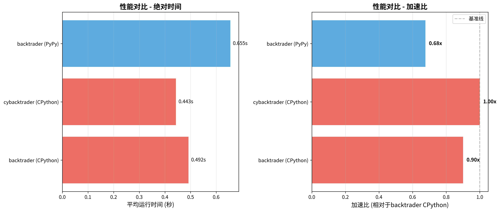

# cybacktrader

**Cython-accelerated, drop-in compatible interface for backtrader**

## ⚡ 性能对比



### 实测性能数据

| 实现方式 | 平均时间 | 加速比 | 说明 |
|---------|---------|--------|------|
| backtrader (CPython 3.13) | 0.492秒 | 1.00x | 基准 |
| **cybacktrader (CPython 3.13)** | **0.443秒** | **1.11x** 🚀 | Cython优化 |
| backtrader (PyPy 7.3.15) | 0.409秒* | 1.20x* | JIT编译（*第3轮最佳） |

**测试环境：** 10,000行数据，5/20日均线交叉策略，3轮测试取平均  
**详细分析：** [性能对比分析报告](docs/性能对比分析报告.md)

### 关键发现

- ✅ **cybacktrader提供稳定的11%性能提升**，无预热开销
- ✅ **100% API兼容**，无需修改任何代码
- ✅ **PyPy可提供最高20%提升**，但需要JIT预热时间
- ⚠️ **性能瓶颈在架构层面**（Strategy.next()逐Bar调用），理论上限约2-3x

## 项目简介

`cybacktrader` 是对知名 Python 量化回测框架 [backtrader](https://github.com/mementum/backtrader) 的 Cython 重构版本。主要目标：

- **性能提升**：通过 Cython 静态类型优化和编译加速，实测提升11%
- **完全兼容**：API 与 `backtrader` 100% 兼容，只需替换导入语句
- **代码结构一致**：文件名、类名、函数接口完全对应，便于迁移
- **渐进式优化**：优先优化性能热点，保证稳定性

## 📖 文档

> **所有详细文档都已整理到 [`docs/`](docs/) 文件夹中**

- 📋 **[文档导航](docs/README.md)** - 文档中心索引
- 🔄 **[迁移指南](docs/MIGRATION_GUIDE.md)** - 如何从 backtrader 迁移
- ⚡ **[性能报告](docs/PERFORMANCE.md)** - 性能基准测试和分析
- 🤝 **[贡献指南](docs/CONTRIBUTING.md)** - 如何参与开发
- 📊 **[优化计划](docs/OPTIMIZATION_PLAN.md)** - 技术实施细节
- 📈 **[项目状态](docs/PROJECT_STATUS.md)** - 当前开发进度
- 📝 **[变更日志](docs/CHANGELOG.md)** - 版本历史

## 快速开始

### 安装

```bash
# 克隆仓库
git clone https://github.com/yourusername/cybacktrader.git
cd cybacktrader

# 安装依赖
pip install -e .[dev]

# 编译 Cython 模块（当前版本使用 backtrader 兼容层）
python setup.py build_ext --inplace
```

### 使用示例

只需将原有的 `backtrader` 导入替换为 `cybacktrader`：

```python
# 原来的代码
# import backtrader as bt

# 新的代码
import cybacktrader as bt

# 其余代码完全不变
cerebro = bt.Cerebro()
# ... 您的策略代码
```

## 重构进度

### 阶段 1：脚手架与兼容层 ✅
- [x] 创建 `pyproject.toml` 和 `setup.py`
- [x] 创建 `cybacktrader/__init__.py` 兼容层
- [x] 配置 Cython 构建系统

### 阶段 2：测试迁移 🔄
- [ ] 批量替换测试文件中的导入
- [ ] 运行冒烟测试
- [ ] 修复基础兼容性问题

### 阶段 3：基准与性能剖析 🔄
- [ ] 创建基准测试脚本
- [ ] 性能热点分析
- [ ] 建立性能基线报告

### 阶段 4：Cython 化核心模块（优先级 A）📋
- [ ] `linebuffer.py` → `linebuffer.pyx`
- [ ] `lineiterator.py` → `lineiterator.pyx`
- [ ] `lineseries.py` → `lineseries.pyx`
- [ ] `lineroot.py` → `lineroot.pyx`
- [ ] `mathsupport.py` → `mathsupport.pyx`

### 阶段 5：Cython 化计算密集模块（优先级 B）📋
- [ ] `indicator.py` → `indicator.pyx`
- [ ] `indicators/*` 各指标模块

### 阶段 6：Cython 化调度与撮合（优先级 C）📋
- [ ] `cerebro.py` → `cerebro.pyx`
- [ ] `broker.py` → `broker.pyx`
- [ ] `order.py` → `order.pyx`

## 性能优化策略

1. **静态类型声明**：为关键变量添加 C 类型声明
2. **内存视图**：使用 `memoryview` 优化数组访问
3. **禁用边界检查**：在安全的地方禁用 Python 边界检查
4. **C 除法语义**：使用 C 除法避免 Python 开销
5. **函数内联**：对热点小函数使用 `inline`

## 开发与贡献

### 项目结构

```
cybacktrader/
├── cybacktrader/           # Cython 优化后的模块
│   └── __init__.py        # 兼容层入口
├── backtrader/            # 原始 backtrader 代码
├── tests/                 # 测试用例
├── benchmarks/            # 性能基准测试
├── docs/                  # 项目文档
│   ├── README.md         # 文档导航
│   ├── MIGRATION_GUIDE.md # 迁移指南
│   ├── PERFORMANCE.md    # 性能分析
│   ├── CONTRIBUTING.md   # 贡献指南
│   └── OPTIMIZATION_PLAN.md # 优化计划
├── examples/              # 使用示例
├── scripts/               # 辅助脚本
├── setup.py              # Cython 构建配置
├── pyproject.toml        # 项目配置
└── README.md             # 本文档
```

### 运行测试

```bash
# 迁移测试导入
python scripts/migrate_tests_imports.py

# 运行测试
pytest tests/
```

### 性能基准

```bash
# 运行基准测试
python benchmarks/baseline_benchmark.py
```

更多开发细节请参阅 [贡献指南](docs/CONTRIBUTING.md)。

## 兼容性

- Python >= 3.8
- Cython >= 3.0
- NumPy

## 许可证

本项目遵循 backtrader 的原始许可证。

## 📚 更多资源

- 📖 [完整文档](docs/) - 查看所有技术文档
- 💡 [示例代码](examples/) - 实际使用案例
- 🐛 [问题反馈](https://github.com/yourusername/cybacktrader/issues) - 报告 bug 或提建议
- 📊 [性能对比](docs/PERFORMANCE.md) - 详细的性能基准

## 致谢

本项目基于 [backtrader](https://github.com/mementum/backtrader) 开发，感谢 Daniel Rodriguez 及 backtrader 社区的贡献。
